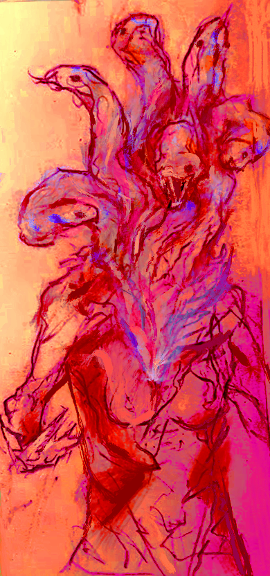

### dramatis personae

##### rahel  
the devil's daughter

the magician to her lover, idyll  
the tower to her mother, ansegdniss

"the dawn star who is the evening star, made divided"

##### idyll  
the ice witch

the high priestess to her lover, rahel  
justice to her enemy, ansegdniss

"the hundred-eyes owl picks over ? raises up the slain"

##### ansegdniss  
the lord of sacrifice

the devil to her daughter, rahel  
the hermit to her enemy, idyll

"all of you, upon that altar. carried with you, that nothing"

##### rahel and idyll
this time dear, this time i know we'll do it right  
(lascivious - soen)  

love  
the ace of swords
sharp clarity  
ambition

##### rahel and ansegdniss
i left me long ago, reasons you'll never know  
(this means war - avenged sevenfold)  

piety  
the eight of cups
disaster, despair  
moving on

##### idyll and ansegdniss
upon the instruments of death, the sunlight brightly gleams  
(epitaph - king crimson)

freedom  
the four of wands
found family  
the fate of the world

  the condition of being a woman is to yield, when it is asked. and to find worth in this act.
  
  put your wants aside, and listen. put your pride aside, and sacrifice. no, to sacrifice others? that is the right of men.
  
  (you won't lead by example, if they won't follow)
  
  we have the pathology of apology as sympathetic magic. if you have overstepped, you must realize, if only I apologize for the same thing.
  
  in exchange for yielding, you are exempt from coercion. you are protected, you are warned, maybe, in time.
  

  you try protecting yourself, to do it all yourself. you will escape the threat of violence through greater violence. to become sovereign, to protect against other predators.

  the world is cruel.
  
  you are judged, not as a man would be. you survive, you surmount life, you leave weakness behind.
  
  you are strong.
    

