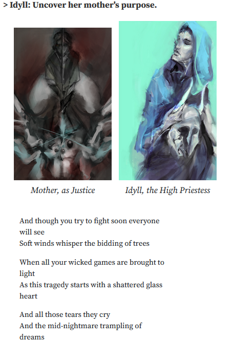

In these statements, I will recount the development of *exul mater*, a work of shuffle literature which interrogates linear forms of meaning-making, using methods and aesthetics derived from tarot and worldbuilding.

I built out *exul mater* from a PROCJAM 2018 entry created in one week. Over two years, the work proceeded through two quarters of critique, and was ultimately exhibited online at ELO 2020. I will here recount my motion from one framing of the work, as a procedural generator using semantically loaded text contents, into treating it as a kind of oracle deck, primarily visual, with a purposefully non 1-1 relation to the text(s).

# Technical Statement

Technical progress on *exul mater* primarily took the form of UX iterations due to playtesting. Although the underlying storylets data model changes over time in small ways, the majority of the work lay in presenting it more or less legibly.

### (ProcJam)

#### Model

##### The General-Purpose Juxtaposer

For the Procedural Generation Game Jam in 2018, I decided to make a game that would turn eight 'aspects' into 56 unique stories, each comprising of 3 passages from a pool of 28 possible aspect-pairs. The major arcana of tarot are a canonical example of aspects, but there are 22 of them. Since I was concerned with a set of only eight aspects, their pairwise combinations wouldn't be wildly out of hand.

#### Implementation

I developed *exul mater* in client-side Javascript, meaning the game can be played in any modern browser, whether on desktop or mobile. While the game space is cramped on a phone screen due to the size of the card art, it remains a playable experience.

As I was working with d3.js event handlers - and on my HTML layout skills in general, -  this was when I discovered the 'pointer-events' CSS property. If I did not turn it off for the tokens while they were being dragged, they would happily intercept the event that allows me to tell which socket they were dropped into.

I also created an interactive SVG animation of an eye, which flinches and blinks according to the proximity of your cursor. This is accomplished using an upper and lower brow, each with three keyframes, which have exactly the same ordering of control points, so that I can lerp between them to smooth the animation.

A 'mousemove' listener allows the pupil to follow the mouse cursor. If the cursor gets too close to the eye, the lower eyelid will flinch. If you poke it, the eye shuts. All this leaves one keyframe unaccounted for - the half-closed position of the upper lid, - which is associated only with poses (pairs of keyframes) corresponding to certain aspects.

### (Critique)

#### First iteration

In (appx.) November of 2018, I presented *exul mater* as a completed text (using three subsets of five aspects, out of eight), using the lights-and-sockets interface, in facilitated critique with a group of digital media students. I mounted the notebook cells in an HTML webpage with a gridded layout, and performed two of the arrangements ('winter grail edge' and 'winter grail lantern', according to my abstract) in a 10-minute demonstration.

(The webpage no longer functions due to a cross-origin request. This screenshot is of the working ObservableHQ notebook. The top line is a 'spinner text' which rotates through a few character options when clicked. The second line is the handle of a function called by a later spinner text to change the iris color of the SVG eye. The remaining lines are part of an aspect backstory, designed to support any number of scenes in which that aspect takes part.)

Alas, when I had taken 'lights in sockets' as an interface metaphor from the Ice-Bound Concordance, I had dispensed with its framing - that these elements were suggestions being made to a co-author contained within the software. And I hadn't really considered that someone might rather spend five minutes experimenting with the piece, than half an hour to re-compose a story from it.

#### Second and third iterations

I had discovered my story direction was sound, although unintentionally opaque. The interface was too abstract to broach, though.

Therefore, I put together a literal representation of 4 aspects connected by 6 scenes. The faces of this tetrahedron, in turn, would represent one entire permutation of the story. By dragging the mouse across it, you could spin the simplex, and whichever side was facing you would display its text(s) below.

As you can imagine, playtesters were intrigued by this interaction, but also more confused.

### (Interactive Media)

#### Demo

I went back and rewrote the story again. But I couldn't have a situation where any scene could appear before any other. So I decided to produce a story-graph of three tetrahedrons in a fixed order.

I tried a couple versions of the interface using modal buttons. One of them had four buttons, each representing the presence or absence of an aspect. There was a lot of hidden state, causing buttons to turn themselves off as you went, because I didn't want to render out all six scene texts if you had hit all the buttons.

(This is what I did with the card spreads, ultimately, when I had a layout that would gracefully scale from three scene texts to six.)

I tried a version where each button represented a slot, and as you clicked the button, it would spin through the remaining aspects. Unfortunately, I neglected to list which aspects were, in fact, remaining. These texts were fun to write, like the character creation spinners, which were also cut by now.

(I found out that playtesters using their own devices could discover interesting edge cases. Earlier, the four-button prototype had, on an iPad, rendered each button as ovals instead of rectangles. By accident, it sometimes resembled a set of mirrors.)

Here is a face of the tetrahedron appearing in a lights-and-sockets spread. Of course, I had decided to use a different input method for each tetrahedron of the story, since I had them all spare anyway.

#### Response

I replaced all of the widgets with cards of the art for each aspect. Then I flew home for the holiday. I remember because I was on Twitter in the airport, thiking about it.

### (uncontinuity)

#### Implementation

During development, I would mainly test on my own laptop with trackpad. But d3.js event handlers and CSS do wonders for cross-platform functionality.

Back to the drag handler. Cards are the same as tokens, with the addition of an SVG viewbox in each, to render a PNG with its appropriate scale and aspect ratio. Output and input are unified, since the card is itself a visual reward for playing it. Triangle arrangements are not mere geometric curios, but semantically charged as well.

But cards that are covered by other cards shouldn't be part of the spread, logically. I made a Piles data structure to keep track of it. And then I made it branching. [Expand.]

# Media Creation Statement

### (ProcJam)

#### Design

Going into the weeklong jam, I had recently completed an analysis of the eight aspects from a certain lore-heavy videogame (left unnamed, as it is the commercial product of an unscrupulous person). I determined an ordering of these aspects which yielded interesting adjacencies and gaps, and employed a distinction proposed Seth Dickinson to further separate the axes of actual (x) from the axes of simulacra (+).

Through the lights-and-sockets prototype, I found that having four or five aspects to hand at a time sufficed to create a feeling of experimentation, so I picked out three subsets of 5 aspects each that I would present as a storyline - rendering certain pairings impossible, and the rest, specific to one or two storylines.

#### Release

Jupiter Hadley, one of the ProcJam organizers, created a series of videos documenting her short playthrough of each game submitted in 2018. This helped me greatly - I wasn't in a games-aligned program then, and the local indie game development group had been convening less often, - in other words, I had no playtesters!

Through mild consternation, this is how I discovered that the game's protagonist had a definite name (or rather, a few). I locked that down, but persisted with the idea of character customization, trying to invoke this multiplicity through elements of personal presentation.

### (Critique)

#### Design

##### Their Barbarian Vicissitudes

The resulting document is a bit less useful than it looks -  while overloading the aspects with verbs, tokens, tenors is good, scenes on the other hand need to be considerably more specific.

* COUP: control, mirror, names, failure, depth
* SACK: control, lacuna, proof, failure, depth
* FLIGHT: serpent, mirror, names, proof, depth

##### The Lyrics Juxtaposer

I had a lot of tracklists lying around for these characters. Surely I could put them to some use? [Figure out these dates.]

#### Release

### (Interactive Media)

#### Design

#### Release

##### Fragmented Reflection and Mourning

### (uncontinuity)

#### Design

##### Relative Linearization

#### Release
