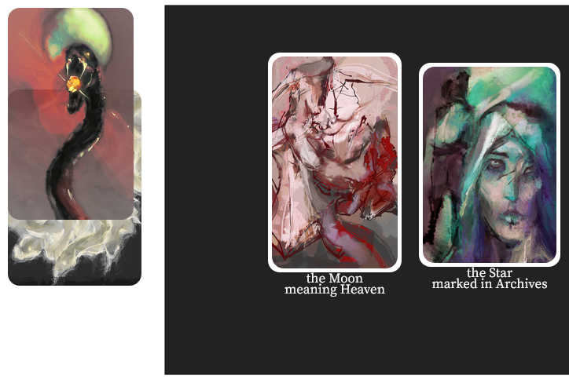

<style>
img {
    max-height: 400px;
}
</style>

In these statements, I will recount the development of *exul mater*, a short and densely written story about a magician, her conquests, and her regrets.

I built out *exul mater* from a PROCJAM 2018 entry created in one week. Over two years, the work proceeded through two quarters of critique, and was ultimately exhibited online at ELO 2020.

[You can play *exul mater* online.](https://projects.cah.ucf.edu/mediaartsexhibits/uncontinuity/Otto/otto.html) And I have written about it [as a work of shuffle literature](https://stars.library.ucf.edu/elo2020/asynchronous/proceedingspapers/12/) which interrogates linear forms of meaning-making, using methods and aesthetics derived from tarot and worldbuilding.

I will here recount my framings of the work over time, at first as a procedural generator using semantically loaded text contents, but eventually becoming a story deck whose visuals are (like an oracle deck) not one-to-one with its texts.

# Technical Statement

The kernel of *exul mater* is in the idea that each passage of scene text corresponds to one pair of cards, chosen from the story deck. In this way, *exul mater* is hybrid between a series of illustrations telling a certain story, and an oracle deck used for the divination of stories matching certain themes.

In combinatorial terms, the user is given a selection of nodes in a graph. The system renders all edges between pairs of these nodes, and it happens that each edge represents a passage of text.


Six possible states of this system are shown above, increasing in complexity from a rendering of 2 nodes (with 1 edge), to a rendering of 4 nodes (with 6 edges). The rendering code is [playable online](https://observablehq.com/@jazztap/simplex-map).

While the exact graph connectivity did change over the project's lifetime, the majority of the implementation work lay in iterations on the user interface in response to playtesting.

### (ProcJam)

#### Model

##### The General-Purpose Juxtaposer

For the Procedural Generation Game Jam in 2018, I decided to make a game that would turn eight 'aspects' into 56 unique stories, each comprising of 3 passages from a pool of 28 possible aspect-pairs. The major arcana of tarot are a canonical example of aspects, but there are 22 of them. Since I was concerned with a set of only eight aspects, their pairwise combinations wouldn't be wildly out of hand.

  
[playable starter template](https://observablehq.com/@jazztap/ritual)

#### Implementation

I developed *exul mater* in client-side Javascript, meaning the game can be played in any modern browser, whether on desktop or mobile. While the game space is cramped on a phone screen due to the size of the card art, it remains a playable experience.

As I was working with d3.js event handlers - and on my HTML layout skills in general, -  this was when I discovered the 'pointer-events' CSS property. If I did not turn it off for the tokens while they were being dragged, they would happily intercept the event that allows me to tell which socket they were dropped into.

  
[live animation (ignore the simplex for now!)](https://observablehq.com/@jazztap/simplex-widget)

I also created an interactive SVG animation of an eye, which flinches and blinks according to the proximity of your cursor. This is accomplished using an upper and lower brow, each with three keyframes, which have exactly the same ordering of control points, so that I can lerp between them to smooth the animation.

A 'mousemove' listener allows the pupil to follow the mouse cursor. If the cursor gets too close to the eye, the lower eyelid will flinch. If you poke it, the eye shuts. All this leaves one keyframe unaccounted for - the half-closed position of the upper lid, - which is associated only with poses (pairs of keyframes) corresponding to certain aspects.

### (Critique)

#### First iteration

In (appx.) November of 2018, I presented *exul mater* as a completed text (using three subsets of five aspects, out of eight), using the lights-and-sockets interface, in facilitated critique with a group of digital media students. I mounted the notebook cells in an HTML webpage with a gridded layout, and performed two of the arrangements ('winter grail edge' and 'winter grail lantern', according to my abstract) in a 10-minute demonstration.


(The webpage no longer functions due to a cross-origin request. This screenshot is of the working ObservableHQ notebook. The top line is a 'spinner text' which rotates through a few character options when clicked. The second line is the handle of a function called by a later spinner text to change the iris color of the SVG eye. The remaining lines are part of an aspect backstory, designed to support any number of scenes in which that aspect takes part.)

#### Second and third iterations

I had discovered my story direction was sound, if not straightforward. But the interface was too difficult.

Alas, when I had taken 'lights in sockets' as an interface metaphor from the Ice-Bound Concordance, I had dispensed with its framing - that these elements were suggestions being made to a co-author contained within the software. And I hadn't really considered that someone might rather spend five minutes experimenting with the piece, than half an hour to re-compose a story from it.

[concordance?]


I put together a literal representation of 4 aspects (down from the 5), each connected by 6 scenes. By dragging the mouse across it, you could spin the tetrahedron (a 3-simplex), and whichever side was facing you would display its text(s) below.

Since THREE.js takes care of both the projection matrix and the camera's 'orbit controls', then I just implemented a distance metric to 'keyframes' hardcoding each viewpoint I wanted to detect (so that I could watch for both edges and faces).

(On the other hand, I did a bad job with the renderer lifecycle, resulting in a notebook cell that re-evaluates itself with each frame rendered. Since the cell output is indeed dynamic, this is only a problem if there are any other inputs displayed by it, because they become hard to interact with.)

[notebook?]

This probably didn't require playtesting, but no, the tetrahedron wasn't any easier to use than the sockets, to specify permutations. I kept the larger size of my static illustrations, but the elaborate animations would have to go.


### (Interactive Media)

#### Demo

I went back and rewrote the story again. But I couldn't have a situation where any scene could appear before any other. So I decided to produce a story in three parts, each containing four aspects.

I tried a couple versions of the interface using modal buttons. One of them had four buttons, each representing the presence or absence of an aspect. There was a lot of hidden state, causing buttons to turn themselves off as you went, because I didn't want to render out all six scene texts if you had hit all the buttons.

(At that time, the scenes wouldn't stay in place if you subsetted their aspects, which was unconducive to reading.)


I tried a version where each button represented a slot, and as you clicked the button, it would spin through the remaining aspects. Unfortunately, I neglected to list which aspects were, in fact, remaining. These texts were fun to write, like the character creation spinners, which were also cut by now.

(I found out that playtesters using their own devices could discover interesting edge cases. Earlier, the four-button prototype had, on an iPad, rendered each button as ovals instead of rectangles. By accident, it sometimes resembled a set of mirrors.)


Here is a face of the tetrahedron appearing in a lights-and-sockets spread. Of course, I had decided to use a different input method for each tetrahedron of the story, since I had them all spare anyway.

#### Response



I replaced all of the aforementioned widgets with decks of cards. To make the cards, I put together the new drag handlers from scratch in a couple hours. Then I dropped it into the notebook with the text assets, and it worked. Cat Manning was kind enough to give it a try over Twitter, and confirmed that four cards was a better number than eight.

Cards are, technically speaking, the same as tokens, with the addition of an SVG viewbox in each, to render a PNG with its appropriate scale and aspect ratio. Output and input are unified, since the card is itself a visual reward for playing it.

But cards that are covered by other cards shouldn't be read as part of the spread. I made a Piles data structure to keep track of which 'faces' are showing, consisting of 'piles' (an array of empty arrays) and an 'index' (an array of -1, meaning no card is in a pile yet). When a card is placed, it moves either into the next vacant pile, or on top of the pile to which the card it's been placed on belongs. Now the faces are the top card of each pile.

### (uncontinuity)

#### Implementation


Now that cards were drawn from a deck, it made sense to offer a fixed number of these as choices, each time a card was drawn. The better to not overwhelm the player with five options at the outset.

I wrote an extension to the logic that populates the playing area with cards, so that each card could create new cards when played, but the card which hadn't been played would be destroyed.


I had the privilege to spend a lot of time in the early days of lockdown making final changes. One of these was to place the text output underneath the 'mat' which keeps cards inside the playing space, and apart from unplayed cards. If you have played cards on top of scenes, you can move them out of the way (or choose not to).

I added a lightbox which lets you zoom in on card art, and provides a snatch of description, representing Irae's status based on the latest card drawn. That text used to sit above the card mat. I wonder if it would have been comfortable there, after all, but I never put it in the HTML layout.

During development, I would mainly test on my own laptop with trackpad. But the d3.js drag event handler and CSS together achieve remarkable cross-platform functionality. You can play *exul mater* on your phone browser, if you don't mind the small size.

#### Response

That's a question I don't have an answer to yet.

# Media Creation Statement

The engine of *exul mater* is in the idea that each pair of character cards in a given deck can be expanded into the text of a dramatic scene. Each card must acquire a certain polysemous resonance with itself, in the process. Through a lens of reflection, this process of reading comes to resemble the accretive process of identity formation.


Tropes of becoming-minor, cybernetic power, and resultant magical corruption, are employed throughout the piece. What I'm saying is, it's about space sorceresses. There are three principals, between eight cards:  

* Ansegdniss, the mother who was exiled. Regards gravitational pull, and personal sacrifice.
* Ida, the lover, doomed as a witch. Regards ice, the woods, and justice.
* Irae, our perspective. Regards fire, venom, and revolution.

This is a piece about going to war, and love that is hate that is love, and disastrous attempts to make that identity legible or even stable, to make it true for all time.

### An Authorial Statement

By layering too much into a character, using all the pieces you find compelling (especially in their contradictions), you find the diffractions that resemble you. Kieron Gillen (noted for writing compelling villains) mentions the feeling of discovering, in the aftermath of a plot, which *part of you* an Other was.

This is a technique to share a feeling, one that is unsafe to write about directly. The fiction shields the feeling from accusations of deliberate confusion, or invalidity. (An edifice I build to abolish the sorrow, to sublimate the rage - to name their cause in coded language.)

Perhaps *exul mater* contains only the kernel of what it says, - a site from which understanding of this pain, which merits nothing, can grow, - but fails to say it. The illegible tragedy itself admits no reflection, only circumlocution.

### History

It's the summer of 2018. I'm between grad programs, excited to join the Creative Coding Lab in the fall. I'm also excited about these ProcJam folks who are very nice, and opening their game jam this week.

Recently, I had done an analysis of an aspect system from a certain videogame (which I will not encourage sales of), taking for inspiration similar analyses - including Emily Short's five aspects (and suits) for Annals of the Parrigues, and (later on) a personality-oriented reading of Magic the Gathering's five colors of mana.

Emily Short characterises **aspects** as complementary and mutually interfering lenses of reading, meaning it is impossible (yet desirable) to take all aspects to the fore simultaneously in a given work. In this way, a set of aspects resembles the basis of a 'semantic space', a frame for reading a work that holds its themes in precise spatialized relation to one another.


 In the case of this videogame, I determined an ordering of its aspects (the middle ring, marked with symbols) which yielded interesting adjacent-pairs (marked on the outer ring) and skipped-pairs (marked on the inner ring). For instance, the chiasmus marked in white connects the aspect of truth with its two adjacencies (thirst and guidance) and its two others (to be branded, to be revealed).
 
 Using Seth Dickinson's distinction between the actual and the virtual, I would further separate the actual (+) from the virtual (x) aspects, yielding four sets of axes.

 - |, Yield/Force
 - -, Death/Life
 - \\, Artifice/Revelation
 - /, Yearning/Branding
 
This represents an improvement on Dungeons and Dragons' two axes of Good/Evil and Chaos/Law, for the specific purpose of stuffing characters into this ontology and seeing what falls out. Kate Compton indicates this mode of reflective play as a trope of casual creation tools. The idea of making your own brushes and mixing your own paints, so to speak, is one we'll return to.

 (To ground it, some arbitrary examples of media works exemplifying one combination of aspects or another are in this diagram. The relevant subreddit, offering feedback, promptly called for the diagram to be deep-fried, i.e. made deliberately illegible with digital artifacting - resulting in the playfully esoteric version here.)


The prototype that I built for ProcJam used these aspects in the aforementioned order, because I wanted to find out whether the other pairings had weight to them.

Thanks to Jupiter Hadley for playtesting all of the ProcJam games that year, and in particular, naming her protagonist in the 'character creation' part of the aspects juxtaposer. I was indeed dismayed, so it turned out I hadn't made a generic plot generator at all.

### Development

##### Their Barbarian Vicissitudes

I picked out three subsets of five aspects each that I would present as a storyline. Each storyline has one turning point:

* The coup, where Irae earns her mother's trust
* The sack, where Irae betrays her mother's nation for her lover
* The flight, where Irae kills her lover to maintain her cover

For each storyline, five aspects suffice to produce enough unique scenes (i.e. not shared with any other storyline). Each scene is a recounting by a principal character. (Later, I would tighten this constraint - each scene must be recounted to another principal, having some rhetorical purpose.)

Overloading the aspects with verbs, tokens, tenors is good. Scenes on the other hand, need to be considerably more specific than a single word - at the very least, they introduce certain events, and have a certain tone.


##### Illuminated Aspects

I remember throwing together the last artwork of the set in the ProcJam prototype, figuring it was a minor thing anyway. But the critique response to the illustrations over the texts was disproportionately strong, given the time constraints.

I spent more time on the paintings, after that, which would represent each aspect.

<div style="display: grid; grid-template-columns: 1fr 1fr 1fr;" markdown="1">


    
</div>

The most difficult of these was the one that would not let me go, because the primary colors (while not a linearly independent basis of RGB space) can have that effect. Alas, the perspective of the sketch was mixed (see how the lower face is seen full on, but so is the upper face, on both figures), and had to all be fixed.

I finished the speedpaint, revisited it a month later, and again a month after. Usually, I would make a new piece. But you can see from the repainted eyes that I went back and forth - who broke the moment? If I set it to *the weight of disaster* (Leprous), there's no clear answer, due to the confusions of memory.

*alone against humanity / dark confusion, necessity / written now in history*

On reflection, we can draw more lyrics (from a certain curated pool) to clarify this card. If we draw *vail monograph, version 2* (Chris Thile), for instance, Irae's ambitions are plainly the greater.

*No, his is the great mind / And it will never be at rest  
Will ever trade this moment for the next / And what it has, for what it’s dreamt*

Even when we cast Ida as the protagonist, as in *face of melinda* (Opeth), she maintains her faith - even when Irae seems to refuse it, -

*She spoke of her vices and broke the rhyme / But baffled herself with the final line  
My promise is made, but my heart is thine*

By abducting the story of this song, we find that it is equally applicable to a Melinda who is more like Baidukh - [a cunning woman](https://twitter.com/jatazak/status/1311466848509071360), raised to heaven to keep her from teaching magic. Sometimes she is Venus, which is Phosphorus, the dawn star, which has two names and is thus divided. 

For our purposes, she is akin also to phosphorus, the devil's element. Molecules of white phosphorus are tetrahedral, so it amuses me that I switched to using sets of four aspects because of said geometry. I will take every visual pun I can get, and every coincidence I can create.

##### The Lyrics Juxtaposer

When I recomposed the story from five-aspect sets down to four, I used a cut-up technique on these lyrics to prompt the scenes. This procedure was instigated by a divination workshop taught by Melissa Weiss Steele, and based on a VR visualization of my Pandora playlists for Angus' class.

The procedure is to pair random three-line slices in a strided order (ABABAB), taken from two songs, and to reveal them slowly. As though this arrangement is yours, and by sharing it, you reveal a hidden part of yourself. I've put a version with built-in search [online as a tool](https://observablehq.com/@jazztap/lyrics-juxtaposer-with-search).

I don't have any shortcut for song collection. Pick ones that remind you of the characters you write about. Make songs that you like into these. It is also true that songs are bound less strongly to characters than to mood. So they pair very well with character illustrations, as fandoms often discover.

![Prompt - Idyll: Uncover her mother's purpose. Left card: a woman astride the spider-beast she is murdering - captioned, Mother, as Justice. Right card: a woman bearing a damaged war-helmet - captioned, Idyll, the High Priestess. Below: And though you try to fight soon everyone will see / Soft winds whisper the bidding of trees // When all your wicked games are brought to light / As this tragedy starts with a shattered glass heart // And all those tears they cry / And the mid-nightmare trampling of dreams](v3_p2.png)

> burning satellites (we as human) / her ghost in the fog (cradle of filth)

For example, we can use a striding of lyrics to connect our two deutergonists, outside of Irae's correspondence. Some revisions later, this prompt becomes:

<div style="font-family: serif;">
IDA:

For her sake I would rewind, to when nothing jagged and weeping resided in you. Before the murder of false masters, those you sought to free us from, whom you became in turn.  

No more the black cloak and armor, no more the steel woven with your ligaments. You chose sacrifice, and then you existed for a long time, alone. You forgot the person you gave up, to become sacred.   

But she could have taught your daughter anything but conquest. She could have brought the girl her father. She could have been weak, for one moment. Your daughter sought the mortal you were, not the woman who is left.
</div>

Which is indeed a direct accusation of poor parenting, which is an odd thing to tell a warlord, and there's a weird ambivalence about whether it is possible to stop choosing sacrifice. I would write Ida differently now, but I've spent a lot more time with her voice, is what happened.

##### Fragmented Reflection and Mourning

I've gone off on allusions already, but they're the foundation of this, now that we're down in the writing guts. The trouble with polysemy is that it bootstraps slowly, but in time it becomes rich - and dense. If you don't read tarot already, then pulling a card is unlikely to bring insight, since less of its polysemy is accessible.

(Note that mathematical intuition and tarot intuition are the very same - if we believe that writing proof depends on having as many representations and interpretations of its subjects *ready to hand* as possible.)

The nice thing about striding lyrics is that if an semantic element recurs in paired songs, it pops into sharp relief - and additionally, both networks of association become connected. Arbitrary choices, names for instance, are the most flexible of connectors. (The trouble with names is that you get nothing back, the first several times you repeat them.)

* **Ansegdniss**: Anglish substitution for the Latin-derived sacrifice, 'to make sacred'. Ostensibly from Old English.
* **Ida**: Possibly short for Adelaide, 'of noble bearing'. Or, a sacred mountain. Or, the Latin for a day of regicide, originally the (notional) day of the full moon.
* **Irae**: *Days of wrath, days that rend the world to ashes.* -- the *Dies irae*, an adaptation to liturgy of a Medieval Latin poem.

As a detailed example, I present a prompt (from juxtaposition, rather than lyrics), a rendering in prose from it, and one step of revision to that prose.

```
Ansegdniss lets her blade drop into Irae's grasp,  
whose spread fingers rest lightly beneath her ear.

Beneath their black points sit slight indentations, 
beneath the ashy skin silvered implants.
```

I would like a scene from Irae's perspective, discussing Ansegdniss' choice here.

```
And so the death-dealing instrument of high office is before me, in your hands. You peel back its slim black casing, of the same metal as your gauntleted hand was. You unbind the weapon's heart and bind it to me.

Your fingers are cold against mine. Their covering is translucently thin. Beneath is the bluish-gray of contractile fibre-bundles and their maze of circulatory supply. The lambent shard in my hand lowly hums, eager to be used. (I cover it hastily.) The nodes of its resonant frequency are in time with the pulse of our blood.
```

But I've missed some beats. I can frontload the parallel between machine and body, without sliding away from the weapon (*its metal skin*). I can perlocute the act of binding (*place it in my palm*). I can stay with the prominence of the veins on aged hands (*bluish-gray maze*), discard the motif of silk hiding steel. I want to perceive those frequency spectra purified by a lens, and their perfect subdivision (*the nodes of its resonant frequency*).

```
So the death-dealing instrument of high office is before me, in your grasp. You peel back its metal skin, blackened as proof against rust. You unbind the weapon's heart and place it in my palm.

Your fingers are cold against mine. Their skin is translucently thin. Beneath, the bluish-gray maze of circulatory supply. The lambent shard lowly hums, eager to be used. The nodes of its resonant frequency re-align themselves with my pulse.
```
