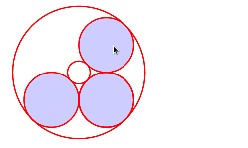
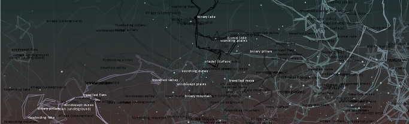

**tl;dr**
I am a mathematical ecologist, ask me about cybernetics. I code science for the web, and this is my portfolio.

### Cognition
Consider how [a neuron transmits](/research/neuron_web/) _[demo]_ an electrical signal, and thereby biochemistry participates in circuitry. Instead of gates built out of transistors, voltage is summed at the neural dendrites. (But see also **morphogenesis** below.)

I've investigated procedural generation of fictional maps like poetry, and iterated fractals under artificial selection, i.e. parameter tuning via a human-in-the-loop providing the utility function to an evolutionary algorithm.

### Geometry
The circle problem of Apollonius asks which circles are tangent to all of three given circles. The nonlinear system certainly has eight complex solutions, which parameterize the solution circles - sometimes nonunique, or out at infinity. The rest, we can [draw in real-time](https://github.com/JazzTap/mcs563/blob/master/README.md) _[repo]_ - whilst _crossing_ these singularities, instead of shooting blindly at them. This uses [a D3 interface to phcpy in Jupyter](research/scipy2017.pdf) _[poster]_, which I presented at SciPy 2017.

By dragging input circles across catastrophes, a beautiful geometric continuity is evinced. (I've done the Python side of a [JupyterHub deployment](https://github.com/JazzTap/jupyterhub) _[repo]_ which can run the notebook out-of-the-box with its phcpy dependency for the nonlinear solver.)

### Pattern
Consider now biological morphogenesis, whose implications [in signalling](research/geobio_pattern/slides.pdf) _[slides]_ I have [written up](research/geobio_pattern/paper.pdf) _[paper, [refs](research/geobio_pattern/refs.pdf)]_ somewhat. Genetic control-flow via selective activation is the more subtle form of biochemical 'circuitry', as exquisite as growth and form itself. Can this high concept can [be sketched](http://ncase.me/simulating/model/?remote=-L1I2RsTvnsoRKFWQnRk) _[demo]_ and *tested* by any in-silico implementation?

Graphics shaders admitting a human-in-the-loop are my first bet for high-performance interactive finite-difference methods, but special boundary conditions (e.g. differential growth implicated in folding) arise. As to the ecological interpretation of *mathematically similar* spatial models, there is crossover with quantitative history and urban planning.

### Dynamics
I began in mathematical biology by studying [individual-based predator-prey dynamics](research/honcap.pdf) _[paper]_ as the population approaches infinity (n -> oo), but remains much smaller than e.g. particles in the air. Notably, self-limitation alone makes a population model nonlinear, even though it emerges readily from the individual-based dynamics under appropriate assumptions.

<small class="side">As a counterexample, when your model predicts 10^-18 foxes in the population's stable limit cycle - that is, a population of this miniscule size will never go extinct - something is absurd. These *attofoxes* are an artifact of assuming *n* continuum-large (as numerous as particles in the air). In fact, small systems of individuals are inherently noisy, prone to sampling error. </small>
  
<small class="side">Similar accidents of discretization are a fact of life, in contradiction to control-theoretic optimality. For instance, isolated populations can and will perish in a black-swan catastrophe, so migration between habitats (incl' refugia - 'eggs in more than one basket') is necessary for conservation.</small>

I believe that network effects tie individual-based models to traditional dynamical models. Symmetrical-relation [collectives](https://sagecell.sagemath.org/?z=eJxtU99vmzAQfi5S_oeT-oCRCFm6qlI78VB1bfeUSl3fsgg5cIBTYzPbaZZN-993B21SbUMCm_N3v777rLreugBm2_V7kB5MP4lqZzvoZOi1DVqtQY2Yfs8GBnW9nkSmz5w0le0yj1iJhTWYwCkoo4KSWv1EcKaZRJPoFG4evjw8PsHt3d3tzdPXKzaNrhD7fddhcKqUOgZZbWSJptxzdqd-UDBYgLEVerA1dFBq6T36SVRhDexa7JRTphF9QlFPTgcse6nQjmAorTFYBg_BAr6g2x8wmwNG1cfUS5VuVnk-n0RAj8MAOZGSSefkXsBySdsDtM9UtVSrFIbNZrWC2jrYcHDqr0HRZ4tkNUb692Gs-gsLySHv1plXGgT9JczkWO0jahmUNdwx81AUzHlRCI-6TsH4lP3yYSCMOWF7tqA-_LYTxiefYLB0ZNFo2HIskSaDPcoAKMsWnpWpILQIjXpBQ4dBdUz_a0xVjeQQx6UMaOgVS9bFEEKo1CRjl6nhPpFUho5BlHI1dHRCMxMNmsGcvBPAGsMOKSVXcEx4PM-5Rx7csJBuSZncMXwj8P_YRu0RjprlRZkgpvP0LAVPcs3FyEo6LslQXy8dpXpjXCzP0o_pOZd-zXS-F6B0ySj2NoTeX81mPsjy2ZLiam13RFE3-75Fz2H87Ozy_MP84uJytkPVtAGraeNk304rJ3cUbbr1_PWywUl0T5k-q3s-F9cp88nTjd88iwMnxaiWmOq4z_iqitJq64r1vtByjTr_Nb-K15qqilOY0t5hFf9OMt_aneCri1WDI9TnT26LAwHUHV196Y7c_wGBpVQi&lang=sage) _[generator]_ inspired by interacting distributions and Golubitsky's dynamics of rhythm. [Weighted motifs](https://sagecell.sagemath.org/?z=eJyFU01v2zAMvQfIfyDQg-3C8Zp9HBbAhwDdggJbe2hvhhEoFm2zUSRBUpp4w_77KLtrO2DAZB8k4fE9PpKigzUugD4e7ADCg7bzWevMAQ4iWGWCoh3QhLFDvIigg1XzmbaFE1qaQ-ERZXprNGZwAaQpkFD0A8Hpbj6bzy7g_uZ28-0LfL97uPl6v4o3UyQEdFo4FpaPokHdDFHW0ZlZgD8j0edABRYxRmjAc0NBBDJ6QbqnHcUtaAwn4_ZwotBDS2eUcELq-uDHOBRND86cII2EGUsM0IsnBEltiw41W3PGovYUBmiNA3MMnSHdQWO0xiaKMJPEliUc36c2Bx_K0TLbAV4aSlCoU5tNZ2oZAeQhglZxX8JrxToMW89GMI0li5IOOQd5bNiT4jQmElSeY98W-k-YD1ksbQQ5fOYWzokhheoV3_SGGkyrZX6VL5Z1DjqfYv6xbFl9uLQV1e8-5rBcxF0O07nOxhQpdoWZO0x1VkP2In90-rlvKZ-y3IeY2zofTT9XrCo-58Wn8X_Pfx19S2wUjwvX-f_1j4wbprumjRO2T9d5RLJqmUy9Rrl9maLtlE3CKW6KOLRpY5Rx292wVWKHqvy5XCU7JZp9ksOC9w5l8isrfG9OY0dQdjhBffngjjhZnc8sewmwLlgR9ZNQR_QjvudHkfiAQg4JjB2CtXy8PHPCex7mtoWUz7CA_U023l7FwfybjX0a57cumkmz6qqulnVEPdxd3624zEKCYaI2kpuWp7qAN4EFN4eHGSynglYJjRAfrRMUit82DT3m&lang=sage) _[generator]_ inspired by systemic thinking.

### Notebooks
To document a numerical inquiry satisfactorily requires an intimate correspondence between equations, experimental method, and code. The notebook paradigm is the most satisfactory approach, spanning two axes of visual response:

##### Rich Output ⇄ Input:
From image display (e.g. plotting a linear transform as pixels), to kernel interfaces (arbitrary calls to *inline* Python, etc.) from Javascript which *minimize* the usually exorbitant technical overhead of domain-nonspecific binding code.

Compare the rich-input analysis of Fitz-Hugh Nagumo above with a [rich-output analysis](https://gist.github.com/JazzTap/a9d74398b2e6252deeeda63c3a3718e3) _[notebook]_ using xarray to study parameter variation by 'painting the space'. Contrast IPyWidgets with the domain-specific input method ('UX design') of Apollonius above.

##### Static ⇄ Dynamic Flow: 
Movement between cells of a notebook implies pipelines for data science.  
(monolithic program → **ordered worksheet** ← ad-hoc REPL)

If I run each cell in order, a meaningful answer must come out. If I sensibly modify an intermediate cell, and run all successive cells in order, a meaningful answer still comes out. By treating the worksheet as a pipeline, we have well-defined invalidation criteria for cached data: while the user traverses the pipeline linearly, the update process is transparent.

<small class="side">Contrast modular but *ad-hoc* situations where a pile of scripts is navigable only by a single graduate student, and stable but *monolithic* situations where the slightest change upstream breaks the entire workflow. The human should be able to advise the machine when they know better which scripts to use, yet still be able to run the procedure when they don't.</small>

The combination of these principles is extremely powerful, suffice to say.

### Reproducibility
Jupyter notebooks have the specific advantage of a FOSS stack underneath, which is philosophically consistent with academia. Contrast Matlab's proprietary viewer, which is free as in beer. Mathematics, of course, is free as in speech. Without reproducibility - not just via corporate funding to acquire the requisite lab infrastructure, but by anyone who takes the time to learn - how is science accountable to itself?

No amount of information is satisfactory without context. Although the quantitative sciences are notoriously insular, distillation through notebooks is a way to keep in touch with the experimental side of our serious play.

### Improvisation
My improvisational ethos derives from jazz drumming and modern dance, and is equally applicable to concise codes, iterative writings, and agile research. I organize some of my [fictional interests by drawing](muses), which keeps me observant.

For contact, please see my CV and social media links above.
