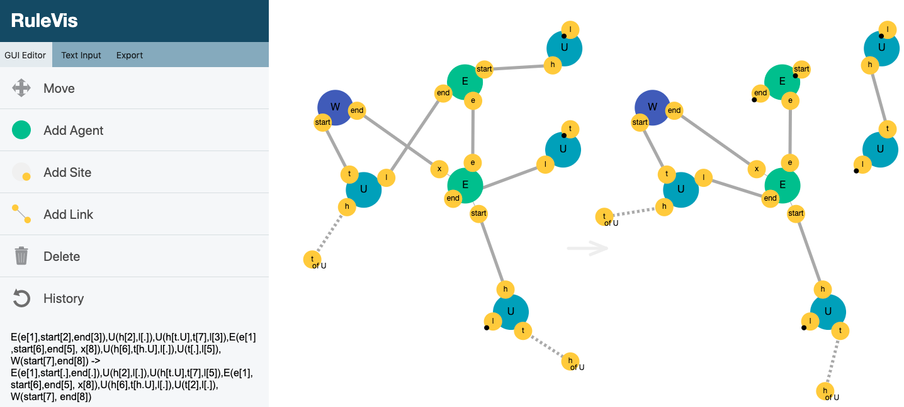

projects | [blog](writes) | [muses](muses)

  
  <h3 id="eis">expressive computation</h3> 
  

  <input type="checkbox" id="montage" />
    <label for="montage">
      
      
<strong>ELO 2020 |</strong> procedural montage

    </label>
    

A combinatorial fiction in tarot. In which space mages are sad about empire.

* In press!

  <input type="checkbox" id="pcg" />
    <label for="pcg">
      
  	  
biomimetic procedural  generation

    </label>
    

* Construction in progress.

  
 <!-- end filmstrip -->

  <h3 id="vis">data visualization</h3>
  

  <input type="checkbox" id="saddle" />
    <label for="saddle">
      
  	  
<strong>IEEE VISAP 2019 |</strong> intuition and saddle&nbsp;points

    </label>
    

**data brushes:** In-browser photo editor. Experiment with brushes carrying the 'style' of famous works of data art.

[Live demo](https://mahikadubey.github.io/Canvas-Style-Transfer/), [code](https://github.com/mahikadubey/Canvas-Style-Transfer), [paper](https://doi.org/10.1109/VISAP.2019.8900858). See also [p5.js docs](https://ml5js.org/reference/api-StyleTransfer/). With [Mahika Dubey](https://www.mahikadubey.com/).

* Dubey, M., Otto, J., &amp; Forbes, A. G. (2019). Data Brushes: Interactive Style Transfer for Data Art. 2019 IEEE VIS Arts Program (VISAP), 1–9. [[DOI]](https://doi.org/10.1109/VISAP.2019.8900858)

  <input type="checkbox" id="skewer" />
    <label for="skewer">
      
  	  
<strong>EuroVis 2019 |</strong>  intergalactic skewers

    </label>
    

* Burchett, J. N., Abramov, D., Otto, J., Artanegara, C., Prochaska, J. X., & Forbes, A. G. (2019). IGM-Vis: Analyzing Intergalactic and Circumgalactic Medium Absorption Using Quasar Sightlines in a Cosmic Web Context. Computer Graphics Forum, 38(3), 491–504. [[DOI]](https://doi.org/10.1111/cgf.13705)

  <input type="checkbox" id="kappa" />
    <label for="kappa">
      
  	  
<strong>IEEE Vis 2019 |</strong> kappavis, 2019

    </label>
    

* Abramov, D., Otto, J., Dubey, M., Artanegara, C., Boutillier, P., Fontana, W., & Forbes, A. G. (2019). RuleVis: Constructing Patterns and Rules for Rule-Based Models. 2019 IEEE Visualization Conference (VIS), 191–195. [[DOI]](https://doi.org/10.1109/VISUAL.2019.8933596)

  
 <!-- end filmstrip -->

  <h3 id="sci">interactive science</h3>
  

  <input type="checkbox" id="phcpy" />
    <label for="phcpy">
      
      
<strong>SciPy 2019 |</strong> steady state locus of a nonlinear system

    </label>
    

[interactive Apollonius problem](https://github.com/JazzTap/mcs563/tree/master/Apollonius) 

Application of phcpy to the **real-time numerical solution** of steady states of nonlinear dynamical systems, as found in synthetic biology, kinematics, and other design spaces. With [Jan Verschelde](http://homepages.math.uic.edu/~jan/).

* Otto, J., Forbes, A., & Verschelde, J. (2019). Solving Polynomial Systems with phcpy. 62–68. [[DOI]](https://doi.org/10.25080/Majora-7ddc1dd1-009)

  <input type="checkbox" id="isocline" />
    <label for="isocline">
      
  	  
limit cycles and lizard mating dynamics

    </label>
    

* [isocline browser widget](https://observablehq.com/@jazztap/rps-matrix-to-isoclines)

**Explorable explanation** of alternative mating strategies in side-blotched lizards. Evolutionary stable states are determined by physiology and local climate. With the [Sinervo Lab](https://web.pbsci.ucsc.edu/research/eeb/sinervo/index.php/en/home/#).

  <input type="checkbox" id="flocking" />
    <label for="flocking">
      
  	  
collective motion as cell fate

    </label>
    

* [notebook in repository](https://github.com/JazzTap/collective-motion)

**Topological data analysis** of spatial effects in collective motion. Builds on prior work with agent-based systems whose population dynamics approach a dynamical system.

  
 <!-- end filmstrip -->

