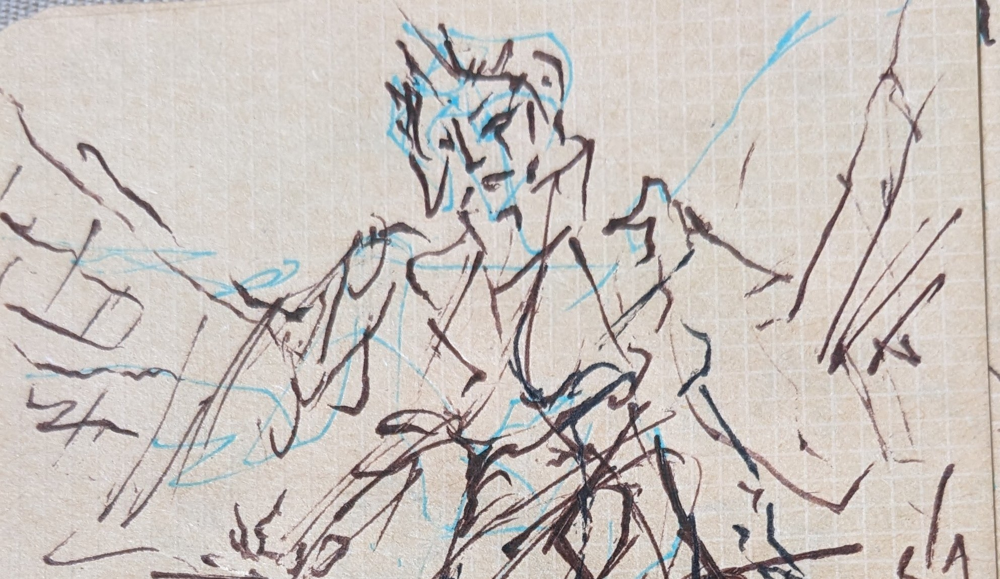
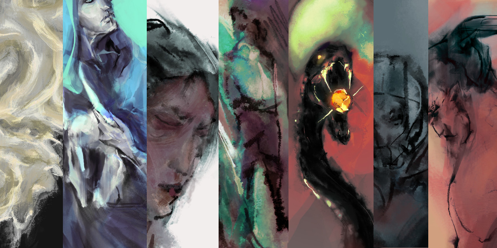

projects | [blog](writes)

  <h3 id="vis">data visualization</h3>
  

  <input type="checkbox" id="schedule" />
  <label for="schedule">
    
    
<strong>2022 |</strong> MarsIPAN

  </label>
  

We created the MarsIPAN (Mars Interactive Pass Allocation Navigator) schedule, and a companion dashboard for comparing allocations. Operations planners are using these visualizations to assess both operational efficiency and staffing requirements across many possible scenarios.

* Manuscript in preparation.

See also our [Data to Discovery 2021 project page](https://datavis.caltech.edu/projects/marsipan/). With thanks to the DTD team and our JPL stakeholders.

 

  <input type="checkbox" id="saddle" />
    <label for="saddle">
      
  	  
<strong>IEEE VISAP 2019 |</strong> intuition and saddle&nbsp;points

    </label>
    

**Stability analysis** of style transfer brushes trained on famous works of data art, in the form of a photo editor. Combines [p5.js style transfer](https://ml5js.org/reference/api-StyleTransfer/) with [d3-brush selections](https://github.com/d3/d3-brush).

[Runs in browser](https://mahikadubey.github.io/Canvas-Style-Transfer/). [Open source code](https://github.com/mahikadubey/Canvas-Style-Transfer).

* Dubey, M., Otto, J., &amp; Forbes, A. G. (2019). Data Brushes: Interactive Style Transfer for Data Art. 2019 IEEE VIS Arts Program (VISAP), 1–9. [[DOI]](https://doi.org/10.1109/VISAP.2019.8900858)

  <input type="checkbox" id="skewer" />
    <label for="skewer">
      
  	  
<strong>EuroVis 2019 |</strong>  intergalactic skewers

    </label>
    

**Spatial analysis** of intergalactic medium absorption, juxtaposing skewer absorption data with distant stars and other emissive bodies.

[Runs in browser](https://creativecodinglab.github.io/Intergalactic/intergalactic.html). [Open source code](https://github.com/CreativeCodingLab/Intergalactic).

* Burchett, J. N., Abramov, D., Otto, J., Artanegara, C., Prochaska, J. X., & Forbes, A. G. (2019). IGM-Vis: Analyzing Intergalactic and Circumgalactic Medium Absorption Using Quasar Sightlines in a Cosmic Web Context. Computer Graphics Forum, 38(3), 491–504. [[DOI]](https://doi.org/10.1111/cgf.13705)

  <input type="checkbox" id="kappa" />
    <label for="kappa">
      
  	  
<strong>IEEE Vis 2019 |</strong> kappavis, 2019

    </label>
    

**Visual rule editor** for the KappaSim language, relating functional sites on macro-molecular agents through the formation and destruction of bonds.

[Runs in browser](https://creativecodinglab.github.io/RuleVis/). [Open source code](https://github.com/CreativeCodingLab/RuleVis).

* Abramov, D., Otto, J., Dubey, M., Artanegara, C., Boutillier, P., Fontana, W., & Forbes, A. G. (2019). RuleVis: Constructing Patterns and Rules for Rule-Based Models. 2019 IEEE Visualization Conference (VIS), 191–195. [[DOI]](https://doi.org/10.1109/VISUAL.2019.8933596)

  
 <!-- end filmstrip -->

  <h3 id="sci">interactive models</h3>
  

  <input type="checkbox" id="skein" />
  <label for="skein">
    
    
<strong>AIIDE 2023 |</strong> DendryScope

  </label>
  

Playtesting support via **interactive static analysis** of routes in quality-based narrative games. Introduces the skein, an interactive heatmap of playtraces, powered by ASP. [Try it online](/DendryScope).

Preprint forthcoming. If you want your own game transpiled from Dendry (or similar), please reach out.

* Otto, J., Chen, A., &amp; Smith, A. M. (2023). DendryScope: Narrative Designer Support via Symbolic Analysis.

 

  <input type="checkbox" id="phcpy" />
    <label for="phcpy">
      
      
<strong>SciPy 2019 |</strong> steady state locus of a nonlinear system

    </label>
    

Application of phcpy to the **real-time numerical solution** of steady states of nonlinear dynamical systems, as found in synthetic biology, kinematics, and other design spaces. With [Jan Verschelde](http://homepages.math.uic.edu/~jan/).

[Open source code](https://github.com/JazzTap/mcs563/tree/master/Apollonius) to interactive solution of the Apollonius circle problem.

* Otto, J., Forbes, A., & Verschelde, J. (2019). Solving Polynomial Systems with phcpy. 62–68. [[DOI]](https://doi.org/10.25080/Majora-7ddc1dd1-009)

  <input type="checkbox" id="isocline" />
    <label for="isocline">
      
  	  
2018 | limit cycles and lizard mating dynamics

    </label>
    

**Explorable explanation** of alternative mating strategies in side-blotched lizards. Evolutionary stable states are determined by physiology and local climate. With the [Sinervo Lab](https://web.pbsci.ucsc.edu/research/eeb/sinervo/index.php/en/home/#).

* [isocline browser widget](https://observablehq.com/@jazztap/rps-matrix-to-isoclines) on Observable

  <input type="checkbox" id="flocking" />
    <label for="flocking">
      
  	  
2018 | collective motion as cell fate

    </label>
    

**Topological data analysis** of spatial effects in collective motion. Builds on prior work with agent-based systems whose population dynamics approach a dynamical system.

* [data notebook](https://github.com/JazzTap/collective-motion) on GitHub

  
 <!-- end filmstrip -->

  <h3 id="eis">expressive computation</h3> 
  

  <input type="checkbox" id="zine" />
  <label for="zine">
    
    
2021 | ira et ius

  </label>
  

 "ira et ius", 16p. self-illustrated lyrical zine. An apocalypse / unveiling, or the end(s) of history.
 
* [pdf](https://jazztap.itch.io/ira-et-ius) on itch.io

  

 

  <input type="checkbox" id="lifeworlds" />
    <label for="lifeworlds">
      
  	  
<strong>Roguelike Celebration 2021</strong> | druid game

    </label>
    

  In "Cyclic Plot Generation in a Mixed-Initiative Narrative Instrument", I compared tarot readings with filmic cuts and tech trees with cyclic dungeon generation, in order to explore (semi) autonomous plot generation.
  
  *  [15min talk](https://www.youtube.com/watch?v=NjIDVIIg1lY) archived on YouTube.

  Ultimately, this yields an approach to the narrative instrument whose substrate is an ordering of scenes. I did my best to reduce my own authorial burden, but have yet to finish the game.

  
  

  <input type="checkbox" id="ccw" />
    <label for="ccw">
      
  	  
<strong>Casual Creators 2020 |</strong> avatar editors

    </label>
    

Case study of a software instrument for avatar creation. Or, a guided tour of latent space.

[thread](https://twitter.com/GalaxyKate/status/1303362289588936705), [paper](https://mkremins.github.io/casual-creators-workshop/papers/ICCC20_paper_197.pdf).

* Otto, J. &amp; Forbes, A. G. (2020). Entering the Design Space of Digital Portraiture: A Case Study in Avatar Creation Tools. 

  <input type="checkbox" id="montage" />
    <label for="montage">
      
      
<strong>ELO 2020 |</strong> exul mater

    </label>
    

An interactive oracle deck developed over the course of my first year as a games scholar, or something of the sort. [Playable online](/exul-mater).

* Otto, J. &amp; Forbes, A. G. (2020). [Procedural Montage: A Design Trace of Reflection and Refraction.](https://stars.library.ucf.edu/elo2020/asynchronous/proceedingspapers/12/) Proceedings of the Electronic Literature Organization Conference 2020.

 

  
 <!-- end filmstrip -->

