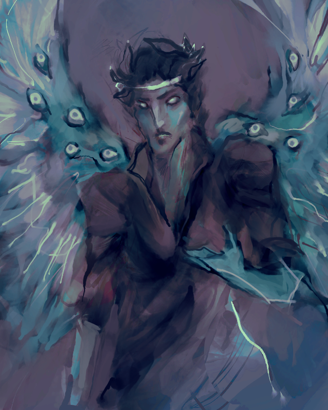
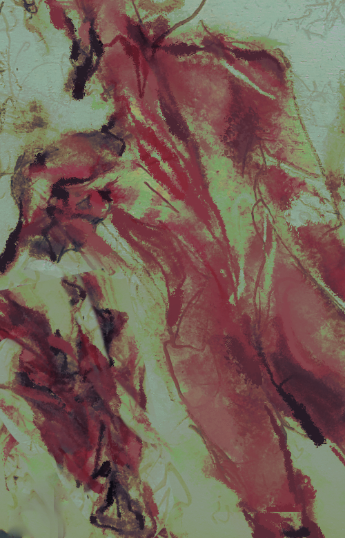
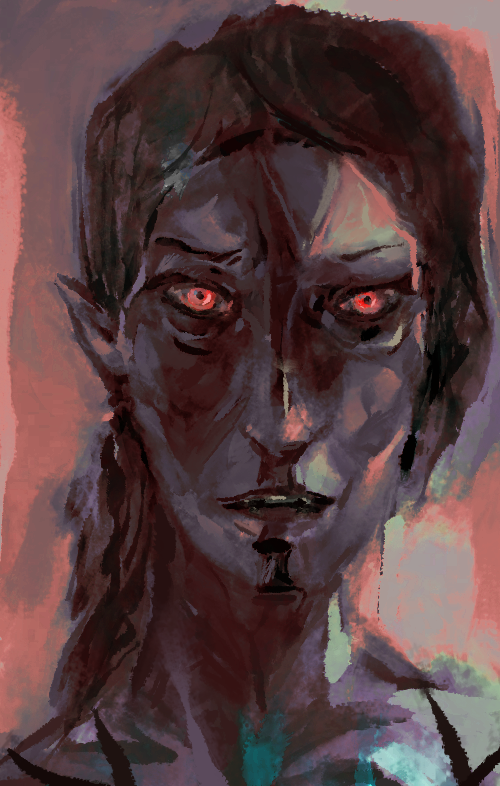
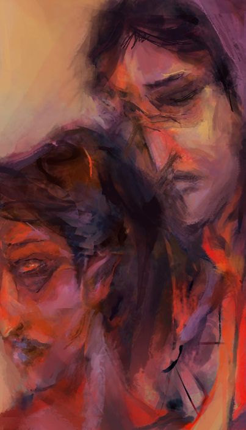
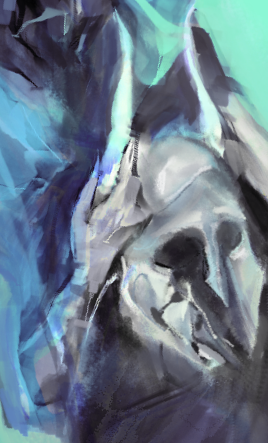

  
a&nbsp;light to burn&nbsp;all the&nbsp;empires, so&nbsp;bright the&nbsp;sun's ashamed   to rise and be

  
you're the one that i need, i'm the one that you loathe   you can watch me corrode

  
            
  
  
everybody knows it's something you had to live with, darling   nobody's gonna tear you down now

  
there is nothing you keep, there is only your reflection

  
        

  
give me heresy, we were never told the truth   the world that spoke

  
give me eyes to see, her never growing old   take heart, it's all fool's gold

  

  
  
  

  
  

  
  

<small>
  
with FOSS digital media (<a href="https://www.gimp.org/">GIMP</a> + <a href="https://code.google.com/archive/p/gps-gimp-paint-studio/">GPS</a>, <a href="https://inkscape.org/en/">Inkscape</a>).

  

    <a href="..">go back</a>
  

</small>