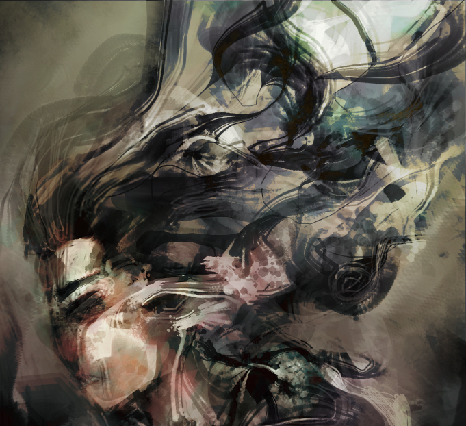
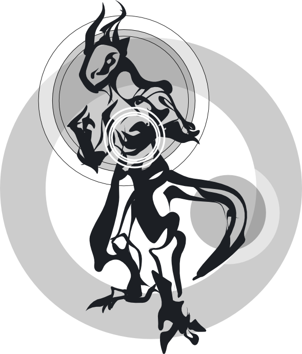
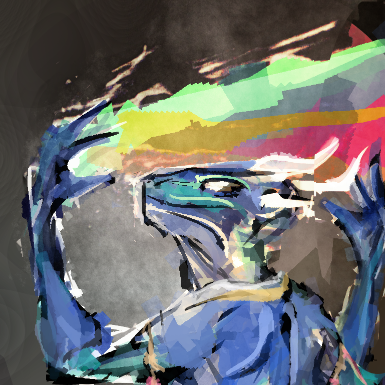
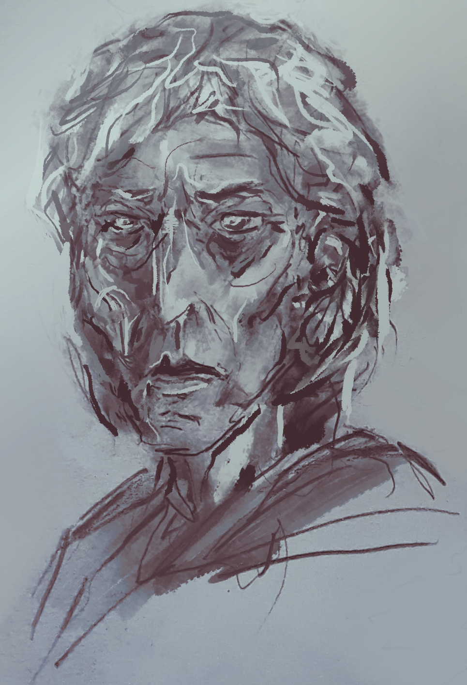

  
and i've grown&nbsp;familiar with&nbsp;villains that&nbsp;live&nbsp;in my&nbsp;head

  
i've searched the universe and found&nbsp;myself within her&nbsp;eyes

  
our memories, well they&nbsp;can be&nbsp;inviting, but some are altogether mighty frightening

  
and the&nbsp;devil's in my&nbsp;head, i&nbsp;will combat

  
  
everything's blackening  i am made of flesh&nbsp;and&nbsp;bone

  
all that riddles&nbsp;me will never cease&nbsp;to&nbsp;be, still&nbsp;i&nbsp;search this&nbsp;world

  
here now&nbsp;comes the&nbsp;sweet, corrupting reality

  
there&nbsp;is nothing you&nbsp;keep, there&nbsp;is only your&nbsp;reflection

  
  

  

  
  
    

  

    
  
  

  

     <!-- style="margin-top: -3rem;" -->
    <small>
      
FOSS digital media (<a href="https://www.gimp.org/">GIMP</a> + <a href="https://code.google.com/archive/p/gps-gimp-paint-studio/">GPS</a>, <a href="https://inkscape.org/en/">Inkscape</a>), 2016 - 2020.

      
<a href="..">go back</a>

    </small>
    

  

