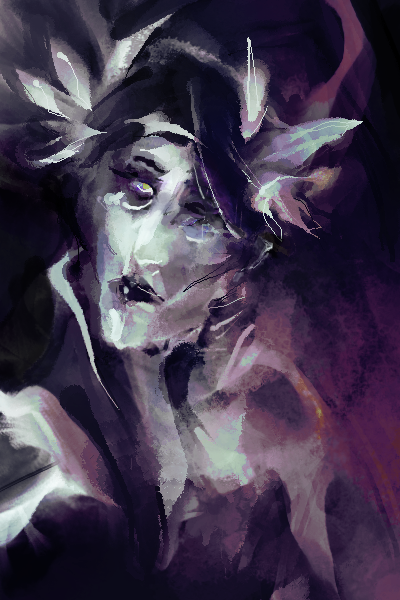
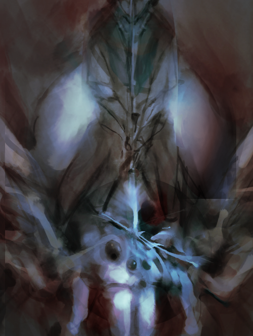
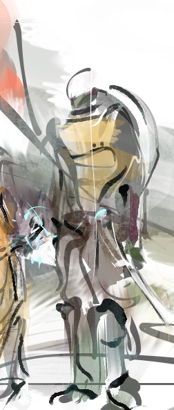

  
  
  

  

  
  
  

  

  

    
    
  

  

  <small>FOSS digital media (<a href="https://www.gimp.org/">GIMP</a> + <a href="https://code.google.com/archive/p/gps-gimp-paint-studio/">GPS</a>, <a href="https://inkscape.org/en/">Inkscape</a>), 2016 - 2020. blink.gif, 2011.</small>
  
  

