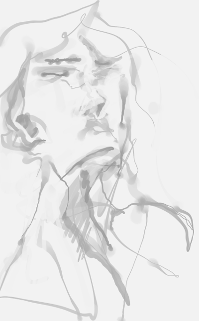

  
will no one lay the laurel  wreath, when silence drowns the screams

  
a light to burn all&nbsp;the&nbsp;empires, so&nbsp;bright the&nbsp;sun&nbsp;is ashamed to&nbsp;rise

  
            
  
here now&nbsp;comes the&nbsp;sweet, corrupting reality

  
  
give&nbsp;up&nbsp;my&nbsp;shame, all&nbsp;of&nbsp;my&nbsp;pain, for&nbsp;you&nbsp;again

  
give me eyes to see  her never growing old (take heart, it's all fool's&nbsp;gold)

  
        

  
I should care to let&nbsp;you&nbsp;fly, a chance to retrieve what was left behind

  
there&nbsp;is nothing you&nbsp;keep, there&nbsp;is only your&nbsp;reflection

  
  

  

  
  
  

  
  

    
    <small>
      
with FOSS digital media (<a href="https://www.gimp.org/">GIMP</a> + <a href="https://code.google.com/archive/p/gps-gimp-paint-studio/">GPS</a>, <a href="https://inkscape.org/en/">Inkscape</a>).

      
<a href="..">go back</a>

    </small>
  

