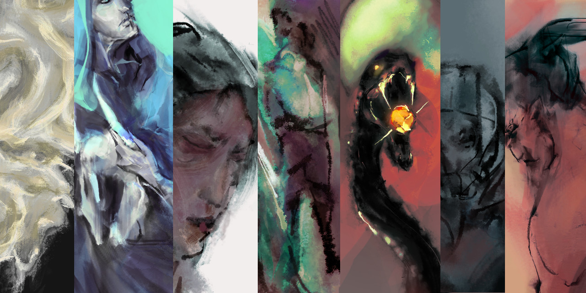
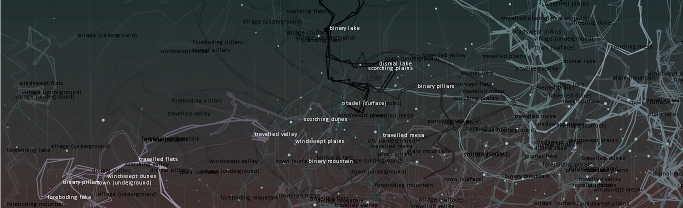

  
  <h3>expressive computation</h3>  
  

    <a href="#montage">
      
      
<strong>ELO 2020 |</strong> procedural montage [forthcoming]

    </a>
    <a href="#juxtaposition">
      
  	  
mere juxtaposition [slides]

    </a>
  

  <h3>data visualization</h3>
  

    <a href="#">
      
  	  
<strong>IEEE Vis Arts |</strong> intuition and saddle points

    </a>
    <a href="#">
      
  	  
<strong>IEEE Vis |</strong> intergalactic skewers

  </a>
  

  <h3>interactive science</h3>
  

    <a href="#">
      
      
<strong>SciPy 2019 |</strong> steady state locus of a nonlinear system

    </a>
    <a href="#">
      
  	  
<strong>--- |</strong> kappavis, 2019

    </a>
  

  <h3>exploratory evolutionary ecology</h3>
  

    <a href="#">
      
  	  
<strong>Sinervo lab |</strong> RPS parameter space browser

    </a>
    <a href="#">
      
  	  
phase spaces slides

    </a>
    <a href="#">
      
  	  
absorbing states in spatialized predator-prey

    </a>
  

  <h3>biomimetic procedural generation</h3>
  

    <a href="#">
      
  	  
pattern formation

    </a>
  

