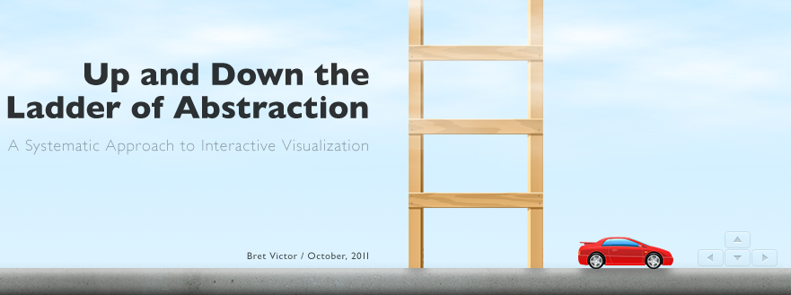

# Scores and Recipes

This review will cover the history of currently active software instrument scenes, including both computational notebooks (a form of literate programming) and explorable explanations.

## Survey of Graphical Instruments (Historical Work)

In this chapter, I will discuss explorable explanations (as circulated among lifelong learners and indie videogame developers) and computational notebooks (as circulated among scientists and journalists) as two scenes that currently are producing novel expository and exploratory *computational mediums*.

A proliferation of interactive visualizations is available from outlets including the New York Times graphics desk. Let's tour the 'explorable explanations' art scene that uses these tools to do fun things with informative material, not least by making the data that it's about possible to poke and prod.

[notebooks for frontend development...]

### Bret Victor
- Some Platforms
	- Joint PI, Communication Design Group [CDG]
	- Designer at Apple Inc., 2007 - 2011
- Some Works
	- Up and Down the Ladder of Abstraction (interactive essay, self-published)
	- Inventing on Principle (talk at Game Developers' Conference [GDC], 2012)

### Alan Kay
- Some Works
	- Dynabook
	- Smalltalk

### Vi Hart
- Some Platforms
	- Joint PI, Communication Design Group [CDG]
	- Researcher at Khan Academy, 2012 - 2015
	- Vihart YouTube channel (1.34 million subscribers)
- Some Works
	- Parable of the Polygons (with Nicky Case, self-published, 2015)
	- Doodling in Math: Spirals, Fibonacci, and Being a Plant [1 of 3] (YouTube, 2011)

In How To Snakes (Vimeo, republished from YouTube, 2011) \cite{https://vimeo.com/147792656}, Vi Hart demonstrates the use of a modular plastic snake toy as a tool for recreational mathematics and personal expression, with affordances such as:
- wearing the snakes
- dropping the snakes
- making a space-filling fractal curve
- jumping rope with a snake
- wearing snake as a mustache
- stop-motion game of Snake (1976)
- configuration space of snakes in terms of 'left' 'right' and 'forward', similar to Logo
- but snakes can't run into themselves, so how many valid configurations are there?
- binary encoding with two-color snakes
- fractal snake (for each head you cut off, add two)
- wearing the snakes on your fingers and making them longer
- stop-motion game of Snake but the snake runs into itself and dies

This video is 2:09 minutes long, and elegantly connects space-filling curves with group theory (of valid snake configurations, called 'slithers'), while also making light of the somewhat arbitrary definition of a slither. While slithers ares shown to be extensible beyond 90-degree turns, they are also clearly irrelevant to cases where the snake is a mustache (or otherwise functioning as a 3D physics object), let alone a hydra (or otherwise incorporating a branching operator that rapidly fills up 2D configuration space).

The above affordances are listed in the same order as presented in the video. Concepts are introduced after concepts they depend on, which are introduced after motivating examples, which also serve as periods of reduced tension, supporting the surrealistic narrative arc. It is clear that any hinged modular toy could have been used to convey these concepts, except that it hinges on a cultural reference involving snakes, and that it is really very fun to chant 'snake'.

### Reza Sarhengi
- Some Platforms
- Organized Events
	- Bridges Math/Art Conference

### Nicky Case
- Some Works
	- Parable of the Polygons (with Vi Hart, self-published)
	- Loopy
	- World in Emoji
- Edited Volumes
	- explorabl.es ()

### Jer Thorp
- Organized Events

### Jonathan McCabe
- Some Platforms
	- **distill.pub**
- Some Works
	- Cyclic Symmetric Multi-Scale Turing Patterns (Bridges, 2010)

### Casey Reas
- Some Platforms
- Some Works

### Uri Wilenski
- Some Platforms
	- Northwestern Institute on Complex Systems, Director
- Contributed Libraries
	- NetLogo

### Simon Papert
- Some Platforms
- Some Works

### Tim Hutton
- Some Platforms
	- Senior Scientist, Microsoft
- Contributed Libraries
	- Ready

### Kate Compton
- Some Platforms
- Some Works

### Don Norman
- Some Platforms
- Some Works

### Emily Short
- Some Platforms
- Some Works
	- Galatea
	- Blood and Laurels

In Glass, a tutorial for Inform 7, the player stands not in a *physical room* but in a topic of conversation. The parser responds to verbs which pertain not to physical navigation, but to steering the conversation toward a fractured fairy-tale outcome.

### Tarn Adams
- Some Platforms
	- Dwarf Fortress
- Some Works
	- [villain system]

### Mike Bostock
- Some Platforms
	- CEO, **ObservableHQ**
	- NYT graphics desk (?)
- Contributed Libraries
	- d3.js
	- Protovis

### Jason Grout
- Some Platforms
	- Jupyter Developer at Bloomberg
	- Mathematics Professor at -- ()
- Contributed Libraries
	- SageMathCell (UTMOST Phase 1)
	- IPython Widgets

### William Stein
- Some Platforms
	- CEO, CoCalc
    - Mathematics Professor at UW ()
- Organized Events
	- SageMathDays

### Chris Olah
- Some Platforms
	- **distill.pub**
- Some Works

### Thomas Robitaille
- Some Platforms
	- astropy
- Contributed Libraries
	- gluevis 

        
### DESIGN: the hands-on essay

Alan Kay secured funding for the Communication Design Group (CDG) in 2013, and hired Dan Ingalls (his collaborator on Smalltalk), Vi Hart (then working at Khan Academy), and Bret Victor (formerly working at Apple) to run it \cite{https://tashian.com/articles/dynamicland/}.

#### A Humane, Dynamic Medium

Bret Victor's work is linked on the explorabl.es site curated by Nicky Case (and many collaborators \cite{https://github.com/explorableexplanations/explorableexplanations.github.io#explorable-explanations}), in particular his influential piece 'Up and Down the Ladder of Abstraction' from 2011.

Kay wanted to make another group like Xerox PARC [...]

#### An Expressive, Extensible Medium

Vi Hart is an artist known for her amusing educational videos about mathematics.

Vi Hart cites Reza Sarhengi, the founder of the math-art conference Bridges, as a formative influence \cite{https://theartofresearch.org/a-history/}, in the context of her decision not to study in a mathematics department but rather, in experimental music.

> I already had spent enough time in the field to know that what they teach in school captures very little of the beauty of mathematics, and I could find that elsewhere. More than I am a mathematician I am a composer...

AUTODIDACTIC and pertaining to VIDEOGAME DEVELOPMENT.

Dynabook -> Vi Hart -> explorable.es, distill.pub, observableHQ

### SCIENCE: the computational dashboard

A proliferation of literate programming has been seen in .

ACADEMIC and pertaining to MATHEMATICAL RESEARCH.

SageMath -> Jason Grout -> matplotlib, IPython widgets, binder

        (You can punt to future touchstones, as well.)

## Two Case Studies of a Software Medium (Current Work)

### Portrait Space and The Sims 3
        Sims 3 CAS (ICCC) - include paper
        
### A Juxtapositional Work of Shuffle Literature
        Exul Mater (ELO) - include paper

## Methods of Traversing Design Space (Future Work - brief)

This section defines a domain-agnostic terminology for navigation in high-dimensional design spaces, oriented toward researchers in computational creativity producing co-creative systems, who desire the accessibility of 'casual creators' whilst respecting the deeply domain-specific structure of their computational medium.

        definitions, pragmatic reading, extrapolate from related work
        

### Explore

    to bake a cake

    to 'approach a monument'

(I think the other way to get around the burden of content-authoring is to use a type system that encodes the entire semantics.)

In practice, I have never been able to design a grammar (meaning a closed semantics that can be compiled, like an API) that is flexible and powerful enough to have expressive utility. Except in the case of learning to draw figures, which I experience as reification:

**a)** In locating a virtual, to be made actual. The strokes on the page become the silhouette of a figure projected into the camera plane, even though this figure is virtual.

(This use of 'virtual/actual' can be replaced with 'absent/present'. \cite{https://courses.nus.edu.sg/course/elljwp/deconstruction.htm})

**b)** In discovering features of the reification that I did not think of in the figure; owing to constraints, they appeared anyway. This is the difference between drawing an eye that represents an eye, or drawing an eye that defines the eye socket of the skull and thus imparts spatial orientation and proportion, in *addition* to its (relatively subtle) effect on the gestalt expression.

This phenomenon is due to the principle that 'music is made of silences', or that 'edges are dual to vertices'. (The entire list of features can reconstruct the whole, and so can the entire list of gaps between features.)

It is as though I possess a mental data structure representing the anatomy of the figure, which contains various relationships and invariants that discourage me from considering a contradictory stroke, so that I am free to select among an array of 'possible next strokes' at random, and moreover this freedom increases as I gain experience with figure drawing.

An instance of this data structure for the *subject* is what I mean by a point in design space. An effective, co-creative software partner encodes some of the skill - meaning the relationships between forms implied by strokes - sometimes literally. The Create-a-Sim sliders, for instance, operate on an entire polygonal mesh (the data structure of the *representation*), as though the strokes comprising the Sim base mesh were printed on some strange analogue of the rubber sheet on which the 'stretchy fish' of Thompson's On Growth and Form were printed.

These relationships of form are the subject of the next section, which pertains to grammar.

### Define

    to write a recipe

    to 'produce a grammatical utterance'

### Explain

    to recommend a recipe

    to 'document a work'
